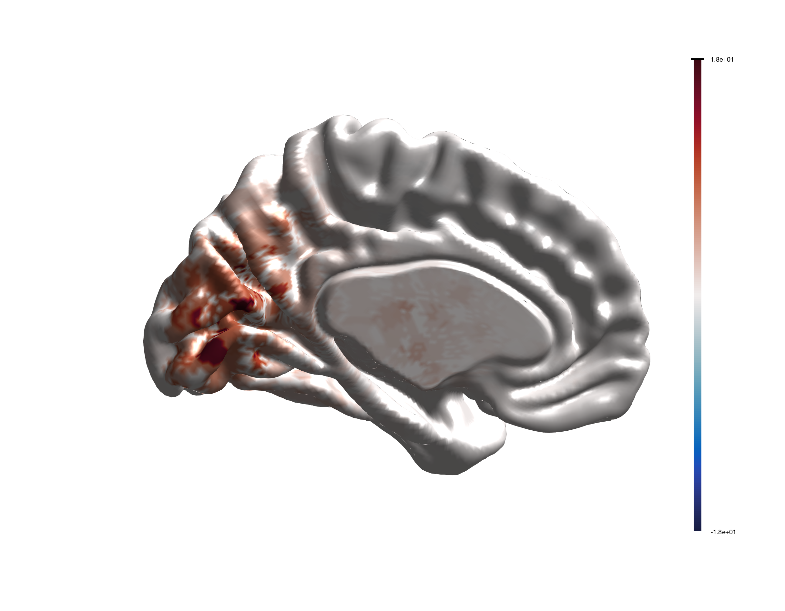
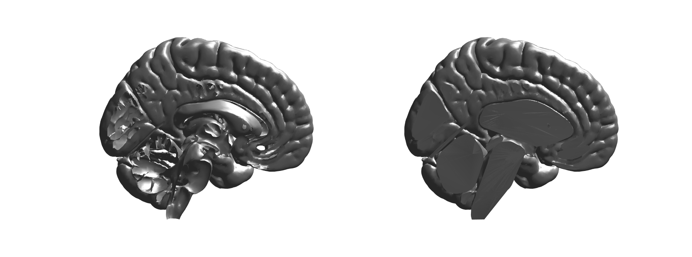

# SourceMesh Features

Plot MEG/EEG functional overlays, networks (nodes & edges) and more on template brains in matlab.

Provide data along with it's sourcemodel coordinates (from, e.g. fieldtrip), use the default AAL90 vertices or define a sourcemodel based on a nifti volume.

Extract iso surfaces from nifti volumes or project statistical nifti volumes on surfaces.

Plot Gifti surfaces and overlays.

Selection of volume-to-surface projection algorithms including euclidean ICP search & ray casting.

Plot whole brain or left / right hemisphere only.

Read & write .edge and .node files.

Export 3D images in 3D file formats VRML and STL.

Transform data into atlas space (AAL90/78/58) and add labels.

Automatically label peaks in functional overlays and show interactively.

Export stationary (camera rotation) and temporal (function over time) videos.

Perform spatial PCA and find local maxima.





# Supported filetypes

Reads: .nii / .nii.gz / .edge / .node / .gii 

Writes: .nii / .gii / .node .edge / .stl / .vrml / videos (format dependent on system)


# What it's for

Plotting functional overlays and networks on brain meshes. 

Includes some compiled cpp code as (linux) mex for speed up for Mac and Linux. If these cause problems, delete them.

*UPDATE: Can export meshes with overlays and networks as .stl and .wrl objects. See example interactive here: https://sketchfab.com/models/9c34500206f641c5a4445dd9d53b7b3e

# USAGE:

Either use the (simple) GUI, preferably, use simple matlab commands.

Takes paired 'Property','Name' values. Examples below. Also see scripts in Examples folder.


# MESHES:
```
% % Plot the default template mesh:
%  atemplate()         

%  % Plot a supplied (gifti) mesh:
%  atemplate('mesh',mesh)   % where mesh is a struct or gifti object with 'veritces' and 'faces' fields

%  % Plot mesh & write out gifti:
%  atemplate('mesh',mesh, 'write',name);  
  
%  % Plot mesh from nifti volume:
%  atemplate('mesh','mymri.nii')
```


```
% % Plot 1 hemeisphere (of default mesh 3), with/without hole-filling:
% atemplate('mesh','def3','hemi','l') ; alpha 1;
% atemplate('mesh','def3','hemi','l','fillholes'); alpha 1;
```



# OVERLAYS:
```
%  % When plotting AAL90 data, you don't need to supply source locations.
%  % Just provide the ovelray values: L [90x1], and whatever options you need - or use a default mesh.
%  atemplate('overlay',L,'method',{'aal_light','spheres'});   
%  % or:
%  atemplate('mesh','def4','overlay',L,'method',{'aal_light','spheres'});   

%  % Plot template with overlay values L at sourcemodel values sormod, interpolated on surface.
%  % Sormod is n-by-3, L is n-by-1.
%  atemplate('sourcemodel',sormod,'overlay',L)  

%  % Plot the supplied gifti mesh with overlay values L at sourcemodel locations 
%  % sormod interpolated on surface. 
%  % Sormod is n-by-3, L is n-by-1.
%  atemplate('gifti',mesh,'sourcemodel',sormod,'overlay',L)  

%  % Plot as above but using a ray casting approach
%  atemplate('gifti',mesh,'sourcemodel',sormod,'overlay',L,'method','raycast') 

%  %  - Plot as above but write out TWO gifti files:
%  %  1. MYGifti.gii is the gifti mesh 
%  %  2. MYGiftiOverlay.gii is the corresponding overlay data
%  atemplate('gifti',mesh,'sourcemodel',sormod,'overlay',L,'write','MYGifti')  

%  % Plot overlay from nifti volume
%  atemplate('overlay','overlay_volume.nii')

%  *Note on sourcemodel option: Some fieldtrip sourcemodels have x & y
%  swapped (?), undo by doing sm = [sm(:,2),sm(:,1),sm(:,3)];

%  % Co-register the surfaces of the nii volumes in mesh and overlay,
%  % put in aal90 space and add labels:
%  atemplate('mesh',t1.nii,'overlay',functional.nii,'template','aal90','labels')

%  % Put overlay in AAL space and use interactive 'peaks' (clickable)
%  atemplate('sourcemodel',sormod,'overlay',overlayvector,'template','aal90','peaks')
```


# OVERLAY OPTIONS
There are currently three different methods for projecting functional overlay data onto meshes.

1) Ray casting: (default) this method grids the source functional data, computes the mesh face normals at each centroid and performs ray casting from each mesh triangle to determine which functional values appear at which mesh face.

2) Euclidean ICP: calculates the closest mesh points to each source point and performs a linear (weighted) iterpolation of the data onto the mesh surface

3) Trap radius: this method inflates a sphere of radius r around each source point. Any mesh vertices falling inside this sphere are coloured with this functional value.

To select a method:

```
atemplate('gifti',mesh,'sourcemodel',sormod,'overlay',L,'method','raycast') 
atemplate('gifti',mesh,'sourcemodel',sormod,'overlay',L,'method','euclidean') 
atemplate('gifti',mesh,'sourcemodel',sormod,'overlay',L,'method','spheres') 

% For AAL90 overlay data, use an additional method flag, as:
atemplate('gifti',mesh,'sourcemodel',sormod,'overlay',L,'method',{'aal_light','spheres'}) 

% This flag invokes a fixed mapping from AAL centroids into a parcellated volume. The second method (spheres in this example) is then used to detmine which values from this new volume appear at which faces of the mesh.

```


# VIDEO OVERLAY:
```
%  % Plot a video overlay and write it out:
%  atemplate('gifti',g,'sourcemodel',sormod,'video',m,'name',times); 
%
%  % Where:
%  - g      = the gifti surface to plot
%  - sormod = sourcemodel vertices
%  - m      = overlay values [vertices * ntimes] 
%  - name   = video savename
%  - times  = vector of titles (time values?)
```


# NETWORKS:
```
%  % Plot template mesh with 90x90 AAL network, A:
%  atemplate('network',A); 

%  % Plot network A  at sourcemodel locations in 'sormod'. 
%  % Sormod is n-by-3, network is n-by-n.
%  atemplate('sourcemodel',sormod,'network',A);  

%  % As above but writes out .node and .edge files for the network, and the gifti mesh file.
%  atemplate('sourcemodel',sormod,'network',A,'write','savename'); 

%  % Plot network defined by .edge and .node files:
%  atemplate('network','edgefile.edge');
```

# Project to ATLAS
```
%  % Put overlay into atlas space: [choose aal90, aal78 or aal58]
%  atemplate('sourcemodel',sormod,'overlay',o,'template','aal58')

%  % Put network into atlas space: 
%  atemplate('sourcemodel',sormod,'network',N,'template','aal78')

%  % Put video into atlas space: 
%  atemplate('sourcemodel',sormod,'video',m,'name',times,'template','aal78')
```

# OTHER:
```
%  % Export 3D images (overlays, meshes, networks) as VRML & .stl:
%  atemplate( ... ,'writestl','filename.stl');
%  atemplate( ... ,'writevrml','filename.wrl');
```

```
%  % Plot default AAL90 node labels on default mesh:
%  atemplate('labels');         

%  % Plot specified labels at centre of roi's specified by all_roi_tissueindex:
%  atemplate('labels', all_roi_tissueindex, labels); 
%
%  % Where:
%  % all_roi_tissue = a 1-by-num-vertices vector containing indices of the
% roi this vertex belongs to
%  % 'labels' = the labels for each roi. 
%  % The text labels are added at the centre of the ROI.
 
 Labels notes:
     - If plotting a network, only edge-connected nodes are labelled.
     - If plotting a set of nodes (below), only those are labelled.
     - Otherwise, all ROIs/node labels are added!

%  % Plot dots at node==1, i.e. N=[90,1]:
%  atemplate('nodes', N);             
```
Any combination of the inputs should be possible.
See scripts in 'Examples' folder for more help.

# GUI:

A basic interface with limited functionality over command line version.

```
SourceMeshGUI
```


# AN EXAMPLE NETWORK (1): 
# from 5061 vertex sourcemodel with AAL90 labels
```
% load New_AALROI_6mm.mat          % load ft source model, labels and roi_inds
% net  = randi([0 1],5061,5061);   % generate a network for this sourmod
% pos  = template_sourcemodel.pos; % get sourcemodel vertices
% labs = AAL_Labels;               % roi labels
% rois = all_roi_tissueindex;      % roi vertex indices
% atemplate('sourcemodel',pos,'network',net,'labels',rois,labs);
```
# AN EXAMPLE NETWORK (2): 
# from volume and node/edge files, put in aal58 space:
```
% atemplate('mesh',t1.nii,'network','test_sourcemod.edge','template','aal58')
```

See also: slice3() slice2()


# Installation 
addpath to wherever the toolbox is:
```
addpath(genpath('~/Downloads/MeshAAL-master'));
```

Dependencies: fieldtrip & spm

# Other Examples


# in development:
add a set of tracks, as loaded with along-tract-stats toolbox
```
atemplate('gifti',g,'tracks',tracks,header);
```


